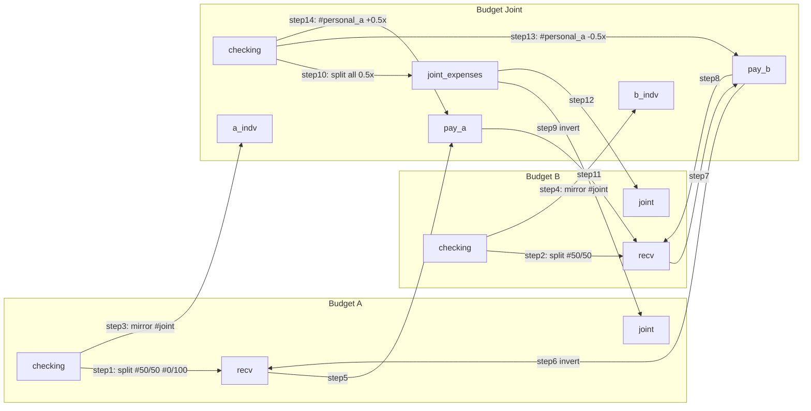

# Joint-finances integration test case

## Goal

Add `test/integration/cases/joint-finances/` with:

- **[before.yaml](test/integration/cases/joint-finances/before.yaml)** – 3 budgets, all accounts declared, transactions only in source accounts.
- **[pipeline.yaml](test/integration/cases/joint-finances/pipeline.yaml)** – 14 pipeline steps.
- **[after.yaml](test/integration/cases/joint-finances/after.yaml)** – expected settled state.

Canonical sort for IDs: budgets alphabetical (A, B, Joint), then account name alphabetically, then `(date, notes ?? '', payee_name ?? '')`, then amount. See [cases README](test/integration/cases/README.md).

---

## Account layout

- **A:** checking, joint, recv, savings
- **B:** checking, joint, recv, savings
- **Joint:** a_indv, b_indv, checking, joint_expenses (offbudget), pay_a, pay_b

All accounts exist in `before.yaml` with `transactions: []` except the source accounts listed below.

---

## Transactions (before state)

**Budget A — account `checking`:**

1. Rum: `2025-01-15`, `-16000`, payee `Total Bev`, notes `#joint #50/50 Rum`, category `Rum`
2. Costco parent: `2025-01-20`, `-8000`, with two subs:
  - Sub 1: `-6000`, payee `Costco`, notes `#joint #50/50 shared part of groceries`, category `Groceries`
  - Sub 2: `-2000`, payee `costco`, notes `#joint #0/100 spent $20 on redbull for partner`
3. Personal: `2025-01-20`, `-4000`, notes `personal` (no `#joint` — not processed by any step)

**Budget B — account `checking`:**

1. King Soopers: `2025-01-18`, `-10000`, payee `King Soopers`, notes `#joint #50/50`, category `Groceries`
2. Personal: `2025-01-22`, `-3500`, no `#joint` tag

**Budget Joint — account `checking`:**

1. Games: `2025-01-25`, `-30000`, payee `Total Escape Games`, category `Games` *(no tag needed — step 9 routes all checking)*
2. United: `2025-01-26`, `-4000`, payee `United Airlines`, notes `#personal_a`, category `Misc`

---

## Pipeline order for minimal iterations

Run steps in **phases** so that no mirror runs before its inputs exist. That way one full round can produce the final state; a second round is only for idempotency.

**Phase 1 — All splits** (create all source-side data)

- Split A:checking → A:recv (step 1)
- Split B:checking → B:recv (step 2)
- Split Joint:checking → joint_expenses (step 10)
- Split #personal_a → pay_b (step 13)
- Split #personal_a → pay_a (step 14)

After phase 1: A:recv, B:recv, Joint:joint_expenses, Joint:pay_a, Joint:pay_b have all split outputs. No mirror has run yet.

**Phase 2 — Mirrors from A and B into Joint**

- Mirror A:checking (#joint) → Joint:a_indv (step 3)
- Mirror B:checking (#joint) → Joint:b_indv (step 4)
- Mirror A:recv → Joint:pay_a (step 5)
- Mirror B:recv → Joint:pay_b (step 7)

After phase 2: Joint has the full picture (pay_a and pay_b include both split-only entries and mirrored personal recv).

**Phase 3 — Mirrors within Joint**  
*(None in this design; pay_a and pay_b are independent. If we added pay_a ↔ pay_b sync, it would go here.)*

**Phase 4 — Mirrors from Joint back out to A and B**

- Mirror Joint:pay_b → A:recv, invert (step 6)
- Mirror Joint:pay_b → B:recv (step 8)
- Mirror Joint:pay_a → B:recv, invert (step 9)
- Mirror Joint:joint_expenses → A:joint (step 11)
- Mirror Joint:joint_expenses → B:joint (step 12)

With this order in `pipeline.yaml`, a single round (all 14 steps in the order above) produces the settled state. The test runner still runs N+1 settling rounds (N = 14) then one idempotency round; with this order the state is correct after round 1, so the remaining rounds are no-ops. If the runner is later changed to stop as soon as a round has no changes, it would stop after 2 rounds (1 settle + 1 idempotency).

**Recommended order in pipeline.yaml (by position, not by step number):**  
1, 2, 10, 13, 14, 3, 4, 5, 7, 6, 8, 9, 11, 12.

---

## Pipeline steps (14 total)

Step numbers below are logical (by function). In `pipeline.yaml`, list them in the phase order above so the pipeline settles in fewer iterations.

### Steps 1–2: Personal splits

**Step 1 — Split A:checking → A:recv**

```yaml
type: split
budget: A
source:
  accounts: ["checking"]
  requiredTags: ["#joint"]
tags:
  "#50/50":
    multiplier: -0.5
    destination_account: recv
  "#0/100":
    multiplier: -1
    destination_account: recv
```

Produces in A:recv: Rum +8000, Costco-grocery +3000, Costco-redbull +2000.

**Step 2 — Split B:checking → B:recv** (same shape, `#50/50` only)

Produces in B:recv: King Soopers +5000.

---

### Steps 3–4: Individual spending visible in Joint (a_indv / b_indv)

**Step 3 — Mirror A:checking (#joint) → Joint:a_indv** (`invert: false`)

Gives Joint a view of what A individually spent on joint items. Rum -16000, Costco parent -8000 appear in Joint:a_indv (informational; same sign as A:checking since money left A).

**Step 4 — Mirror B:checking (#joint) → Joint:b_indv** (`invert: false`)

King Soopers -10000 appears in Joint:b_indv.

---

### Steps 5–8: Symmetric two-way settlement mirrors

**Step 5 — Mirror A:recv → Joint:pay_a** (`invert: false`)

A's split outputs (+80, +30, +20) flow into pay_a so Joint sees "what A is owed."

**Step 6 — Mirror Joint:pay_b → A:recv** (`invert: true`, return leg)

**Step 7 — Mirror B:recv → Joint:pay_b** (`invert: false`)

B's split output (+50) flows into pay_b so Joint sees "what B is owed."

**Step 8 — Mirror Joint:pay_b → B:recv** (`invert: false`)

B's pay_b entries (including the +2000 United reimbursement from step 13) propagate to B:recv so B sees their own claims.

**Step 9 — Mirror Joint:pay_a → B:recv** (`invert: true`, return leg)

**Why the return legs cross and invert:** In a two-person settlement, A:recv net and B:recv net must be **exact opposites**. Each person's recv must show: (my claims from my splits) **minus** (the other person's claims). So A:recv must get **B's** claims as negatives — hence **pay_b → A:recv** with `invert: true` (step 6). B:recv must get **A's** claims as negatives — hence **pay_a → B:recv** with `invert: true` (step 8). Concretely: step 6 copies pay_b (+5000 King Soopers, +2000 United) into A:recv as **-5000, -2000**. Step 9 copies pay_a (+8000, +3000, +2000, -2000 United) into B:recv as **-8000, -3000, -2000, +2000**. Step 8 copies pay_b into B:recv (no invert) so B also gets their own +5000 and +2000. Then A:recv net = +80+30+20-50-20 = **+60** and B:recv net = +50+20-80-30-20+20 = **-60**. Without the cross mirrors (steps 6 and 9) with invert, the two nets would not be opposites (design bug).

---

### Steps 10–12: Joint expenses shared view (⚠️ requires code change)

**Step 10 — Split Joint:checking → Joint:joint_expenses (all transactions, no tag)**

```yaml
type: split
budget: Joint
source:
  accounts: ["checking"]
default:                          # NEW FEATURE: route all untagged/all txs
  multiplier: 0.5
  destination_account: joint_expenses
```

Currently the split engine requires a matching tag to route a transaction — there is no "catch-all" path. This step requires adding a `default` action to `SplitStepSchema` that applies when no specific tag matches (or when `tags` is omitted). Minimal change: optional `default: { multiplier, destination_account }` in the split config and a corresponding branch in `createSplitEngine`.

Effect: Games -30000 → joint_expenses -15000; United -4000 → joint_expenses -2000. `joint_expenses` is `offbudget: true`.

**Step 11 — Mirror Joint:joint_expenses → A:joint** (`invert: false`)

**Step 12 — Mirror Joint:joint_expenses → B:joint** (`invert: false`)

---

### Steps 13–14: United Airlines #personal_a correction

United (-4000) was already routed 50/50 into joint_expenses (-2000 each → A:joint and B:joint). But United is 100% A's, so joint_expenses mistreated B (-$20 too much) and A (-$20 too little). Correction via settlement accounts:

**Step 13 — Split Joint:checking (#personal_a) → pay_b**

```yaml
type: split
budget: Joint
source:
  accounts: ["checking"]
  requiredTags: ["#personal_a"]
tags:
  "#personal_a":
    multiplier: -0.5
    destination_account: pay_b
```

United -4000 × -0.5 = **+2000** in pay_b ("joint owes B $20 back"). Step 8 (pay_b → B:recv) then propagates +2000 to B:recv.

**Step 14 — Split Joint:checking (#personal_a) → pay_a**

```yaml
type: split
budget: Joint
source:
  accounts: ["checking"]
  requiredTags: ["#personal_a"]
tags:
  "#personal_a":
    multiplier: 0.5
    destination_account: pay_a
```

United -4000 × 0.5 = **-2000** in pay_a ("A owes joint $20 extra"). That -2000 shows up in A:recv via step 6 (pay_b → A:recv invert): pay_b gets +2000 from step 13 (B reimbursed); step 6 inverts it so A:recv gets **-2000** (A charged).

Steps 13 and 14 must be **two separate split steps** — the split engine allows only one tag → one destination per step.

#### Holes in the United correction model

- **Are A:joint and A:recv double-counting?** No — they serve different purposes. A:joint (-$20 from joint_expenses) is informational: "A's share of joint money spent." A:recv (-$20 from pay_a United correction) is settlement: "A owes joint $20 extra on top of their share." From A's total budget perspective these are additive and correct: A bears the full -$40 for United ($20 as a joint-expense share + $20 as a settlement correction). B:joint (-$20 informational) is cancelled by B:recv (+$20 reimbursement), netting B to $0 for United.
- **Sign sensitivity:** The multipliers -0.5 (step 13) vs 0.5 (step 14) on the same -4000 source are easy to get backwards. Step 13 must produce a *positive* pay_b entry (B reimbursed); step 14 must produce a *negative* pay_a entry (A charges). Verify against the balance summary before writing after.yaml.
- **Why half ($20) and not full ($40)?** The joint_expenses split already handles $20 of each person's share. The correction accounts for the *remaining* discrepancy, not the full United charge.

---

## Two-way mirror feedback cycle

Two-way mirrors (e.g. step 5 A:recv→pay_a plus step 8 pay_b→B:recv) can create feedback. Here is exactly why they do not — and when they would fail:

**How the loop is prevented:**

```
Round 1, Step 5: A:recv has TX-rum (imported_id=ABMirror:A:checking-rum-uuid).
                 Mirror copies it to pay_a with the same imported_id.

Round 1, Step 8: pay_b is copied to B:recv (no invert). Entries in pay_b have imported_id
                 from B's splits. B:recv already has those from step 2; indexExistingMirrored
                 finds them. No duplicate. Step 9 (pay_a → B:recv invert) proposes B:recv
                 entries from pay_a; dedup by canonical imported_id prevents loops. ✓
```

The dedup key is derived from the **canonical origin** (the original budget+tx pair), not the intermediate hop. So the second leg of a two-way mirror always resolves to the same key as the first leg's source and produces no change after round 1.

**Where this breaks (requires code fix):** Steps 5–9 cross budgets (A ↔ Joint, B ↔ Joint). The `indexExistingMirrored` function must correctly find A:recv transactions from Joint's mirror perspective using `indexBudgetIds`. If the cross-budget index is not populated for this bidirectional 3-budget case, dedup fails, each round adds a copy, and the test reports "pipeline did not converge." This is the primary correctness requirement on the existing code — it may require changes in [sync-engine.ts](src/diff/sync-engine.ts) or [sync-helpers.ts](src/diff/sync-helpers.ts).

**Desired behaviour (define as the test target):** two-way mirrors converge after at most 2 settling rounds with zero oscillation, regardless of step order.

---

## Balance summary (after state)

- **A:recv** — +8000 (Rum 50%), +3000 (Costco 50%), +2000 (Costco 0/100) from splits; **-5000** from inverted mirror of pay_b (B's King Soopers claim); **-2000** (United correction via pay_a). Net = **+$60** (A is owed $60 by B).
- **A:joint** — -15000 (Games share), -2000 (United informational share)
- **B:recv** — +5000 (King Soopers 50%) from split; **-8000, -3000, -2000** from inverted mirror of pay_a (A's claims); **+2000** (United reimbursement via pay_b). Net = **-$60** (B owes A $60).
- **B:joint** — -15000 (Games share), -2000 (United informational share, cancelled by B:recv +2000)
- **Joint:pay_a** — mirrors A:recv (step 5): +8000, +3000, +2000, -2000
- **Joint:pay_b** — mirrors B:recv (step 7): +5000, +2000
- **Joint:a_indv** — -16000 (Rum), -8000 (Costco parent)
- **Joint:b_indv** — -10000 (King Soopers)
- **Joint:joint_expenses** — -15000 (50% Games), -2000 (50% United)

**Invariant:** A:recv net (+$60) and B:recv net (-$60) are exact opposites. In a two-person settlement, one person cannot be owed and also owe; the nets must sum to zero.

---

## Data flow diagram




---

## Implementation order

1. Create `before.yaml`: 3 budgets, all accounts (accounts in alphabetical order within each budget, empty accounts have `transactions: []`), 7 source transactions in global sort order.
2. Create `pipeline.yaml` with steps 1–14 as above. For step 10, write the desired YAML with `default:` and add a `# TODO: requires split default action code change` comment.
3. Create a minimal `after.yaml` (just `budgets: {}`) and run `npm test`. The failure output shows the actual exported fixture — copy that in as `after.yaml` and verify against the balance summary.
4. Implement the `default` action for the split step (step 10); update `after.yaml` to include joint_expenses entries.
5. Verify cross-budget two-way mirror convergence; fix `indexBudgetIds` handling if oscillation is observed.

---

## Code changes required

- **Split step `default` action (step 10):** Add optional `default: { multiplier, destination_account }` to `SplitStepSchema` in [src/config/schema.ts](src/config/schema.ts). In `createSplitEngine` ([src/engines/split-engine.ts](src/engines/split-engine.ts)), when a transaction matches no tags and `opts.defaultAction` is set, apply it instead of skipping.
- **Cross-budget bidirectional mirror dedup (steps 5/6, 7/8):** Verify that `indexExistingMirrored` in [src/diff/sync-helpers.ts](src/diff/sync-helpers.ts) correctly deduplicates using the canonical imported_id when mirroring across budgets in both directions. The `indexBudgetIds` mechanism in [src/engines/mirror-engine.ts](src/engines/mirror-engine.ts) must cover this bidirectional 3-budget case.

