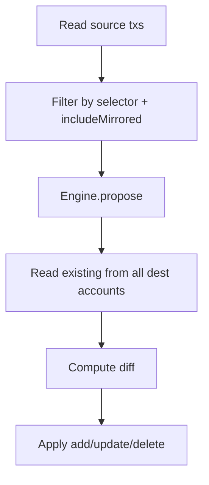

# Common Sync Library

## Goal

Build `runSyncEngine(engine, opts, manager)` where both mirror and split implement the `SyncEngine` interface. The library handles creation, update, deletion, and idempotency. Engines only provide match/filter and transform logic.

---

## Flow




---

## Engine Interface

```typescript
interface SyncEngine {
  propose(sourceTxs: ActualTransaction[], opts: EngineOpts): ProposeResult;
  getDestBudgetId(opts: EngineOpts): string;
  getDestAccountIds(opts: EngineOpts): string[];
}

interface ProposeResult {
  desired: Map<string, { accountId: string; tx: NewTransaction }>;
  onWarn?: (code: string, detail: unknown) => void;
}
```

**Key**: `sourceId:destAccountId` (unified for both). Indexing uses `parsed.txId + ":" + tx.account`.

**EngineOpts** (from orchestrator): `sourceBudgetId`, `destBudgetId`, `includeMirrored`, selector config, etc.

---

## Common Library Responsibilities


| Responsibility  | Notes                                                                                                                |
| --------------- | -------------------------------------------------------------------------------------------------------------------- |
| Read source txs | Accounts + selector (requiredTags)                                                                                   |
| Filter ABMirror | Skip txs with `ABMirror` imported_id unless `includeMirrored` (maps from `copyMirrored` / `splitMirrored` in config) |
| Index existing  | ABMirror + budgetId filter; key = `sourceId:destAccountId`                                                           |
| Compute diff    | toAdd, toUpdate, toDelete from desired vs existing                                                                   |
| Apply           | addTransactions, updateTransaction, applyDeletes (with re-verify)                                                    |


`**includeMirrored`**: Single flag in opts. Mirror step uses `copyMirrored`, split step uses `splitMirrored`—both map to `includeMirrored` when building opts. Common lib does the filter; engines don't.

---

## Engine-Specific Logic Only


| Engine | Match/filter                           | Transform                        | Dest           |
| ------ | -------------------------------------- | -------------------------------- | -------------- |
| Mirror | Every selector match                   | Copy or invert; category mapping | Single account |
| Split  | Exactly one action tag; multi-tag warn | amount × multiplier              | Per tag        |


---

## Destination Scope and Limitation

**Read from all dest accounts** in the step config. Handles transaction content changes (e.g. tag `#50/50` → `#0/100`): delete from old dest, add to new.

**Known limitation**: Config changes can strand transactions. If you remove a destination from config, we stop reading it; txs there stay.

**Migration pattern**: Add `"#legacy" -> old_account` temporarily, run pipeline (stranded txs get deleted), remove `#legacy`. Document in README. User controls `lookbackDays`.

---

## Implementation

**Files**: `src/diff/sync-helpers.ts` (or split into util/diff modules)

- `indexExistingMirrored(destTxs, budgetId)` → `Map<key, tx>`
- `computeDiff(desired, existing)` → `{ toAdd, toUpdate, toDelete }`
- `applyDeletes(toDelete, expectedBudgetId)` — re-verify before delete

**Migration**:

1. Add `runSyncEngine`, `SyncEngine` interface, shared helpers.
2. Implement mirror engine and split engine as adapters.
3. Wire orchestrator to `runSyncEngine`.
4. Document destination-change limitation and `#legacy` migration in README.

